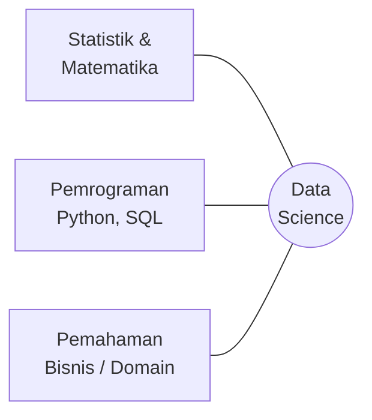
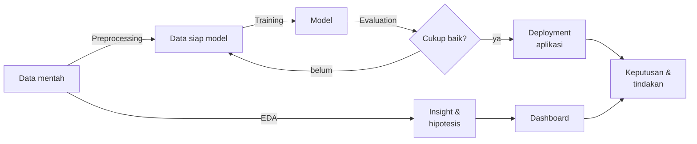

# Modul 0 — Konsep Dasar Data Science (untuk Pemula)

> **Tujuan modul:** memahami istilah-istilah dasar data science dengan **bahasa sederhana dan analogi sehari-hari**, termasuk penjelasan mendalam tentang **EDA (Exploratory Data Analysis)**, sebelum masuk ke modul-modul teknis.
>
> Jika Anda sudah pernah belajar data science, modul ini tetap berguna sebagai penyegaran. Jika Anda benar-benar pemula, **mulailah dari sini.**

---

## 0.1 Apa itu data science?

**Data science** adalah ilmu untuk **mengubah data menjadi keputusan**.

> 🕵️ **Analogi: detektif.** Seorang detektif mengumpulkan bukti (data), memeriksa TKP dengan teliti (eksplorasi), menyusun dugaan (hipotesis), menguji dugaan itu, lalu menyimpulkan siapa pelakunya (insight) dan merekomendasikan tindakan (keputusan).

Data science menggabungkan tiga bidang:



Tanpa **statistik**, kita salah menarik kesimpulan. Tanpa **pemrograman**, kita tidak bisa mengolah ribuan data. Tanpa **pemahaman bisnis**, hasilnya tidak berguna bagi siapa pun.

### Peran-peran di dunia kerja

| Peran | Fokus | Di proyek ini |
|---|---|---|
| **Data Analyst** | menjawab "apa yang terjadi dan kenapa?" lewat analisis & dashboard | EDA, dashboard Metabase |
| **Data Scientist** | membangun model prediksi & menguji hipotesis | model Logistic Regression |
| **ML Engineer** | membawa model ke produksi agar bisa dipakai | aplikasi Streamlit & deployment |
| **Data Engineer** | menyiapkan saluran & penyimpanan data | PostgreSQL, Docker |

Proyek ini menyentuh **keempat peran** dalam skala kecil.

---

## 0.2 Data, dataset, baris, kolom

- **Data** = catatan fakta. Contoh: "Mahasiswa A berusia 19 tahun, mengambil 6 mata kuliah, lulus 5."
- **Dataset** = kumpulan data yang tersusun rapi, biasanya berbentuk **tabel** (seperti sheet Excel).
- **Baris** (row / observasi / record) = satu objek yang diamati. Di proyek ini **1 baris = 1 mahasiswa**, total 4.424 baris.
- **Kolom** (column / variabel / atribut) = satu jenis informasi. Contoh: `Age_at_enrollment`, total 37 kolom.

```
         kolom →   Course  Gender  Age  ...  Status
baris ↓   mhs 1     9254     1      19  ...  Graduate
          mhs 2      171     1      20  ...  Dropout
          ...
```

### Fitur vs target

| Istilah | Nama lain | Arti | Di proyek ini |
|---|---|---|---|
| **Fitur** | feature, variabel independen, X, input | informasi yang dipakai untuk menebak | usia, nilai, status pembayaran, … (19 kolom) |
| **Target** | label, variabel dependen, y, output | hal yang ingin ditebak | `Status` → dropout atau tidak |

> 🩺 **Analogi dokter:** gejala pasien (demam, batuk, suhu) adalah **fitur**; diagnosis (flu atau bukan) adalah **target**.

---

## 0.3 Alur proyek data science

> 🍳 **Analogi memasak:** (1) tentukan mau masak apa untuk siapa → (2) periksa bahan di kulkas → (3) cuci & potong bahan → (4) masak → (5) cicipi → (6) sajikan.

| Langkah memasak | Tahap data science | Istilah |
|---|---|---|
| Tentukan menu & tamu | Pahami masalah bisnis | Business Understanding |
| Periksa bahan: masih segar? cukup? | Kenali & jelajahi data | Data Understanding + **EDA** |
| Cuci, kupas, potong | Bersihkan & siapkan data | Data Preparation / Preprocessing |
| Masak | Latih model | Modeling |
| Cicipi | Ukur kualitas model | Evaluation |
| Sajikan ke tamu | Pakai model di dunia nyata | Deployment |

Kerangka resmi untuk alur ini disebut **CRISP-DM** ([Modul 1](01-gambaran-besar-proyek.md#15-kerangka-kerja-crisp-dm)).

---

## 0.4 ⭐ Apa itu EDA (Exploratory Data Analysis)?

### Definisi
**EDA (Exploratory Data Analysis / Analisis Data Eksploratif)** adalah proses **menjelajahi dan "berkenalan" dengan data** menggunakan **ringkasan statistik dan visualisasi**, *sebelum* membuat model atau mengambil kesimpulan formal.

Istilah ini dipopulerkan oleh statistikawan **John W. Tukey** lewat bukunya *Exploratory Data Analysis* (1977). Pesannya: **lihat datanya dulu dengan pikiran terbuka**, jangan langsung menguji rumus.

> 🩺 **Analogi: pemeriksaan dokter sebelum memberi obat.** Dokter yang baik tidak langsung menulis resep. Ia mengukur suhu, tekanan darah, bertanya riwayat, memeriksa hasil lab, lalu baru mendiagnosis. EDA adalah "pemeriksaan" terhadap data.
>
> 🏠 **Analogi: membeli rumah.** Sebelum membeli, Anda berkeliling: melihat setiap ruangan, mengecek atap bocor, retak di dinding, lingkungan sekitar. Membuat model tanpa EDA sama seperti membeli rumah hanya dari brosur.

### Kenapa EDA sangat penting?
Karena prinsip **"garbage in, garbage out"**: model yang dilatih dengan data bermasalah akan menghasilkan prediksi bermasalah, secanggih apa pun algoritmanya.

### 6 tujuan EDA

| # | Tujuan | Pertanyaan yang dijawab | Contoh di proyek ini |
|---|---|---|---|
| 1 | **Memahami struktur** | Berapa baris/kolom? Tipe datanya apa? | 4.424 × 37; kolom berkode seperti `Course` |
| 2 | **Memeriksa kualitas** | Ada data kosong? duplikat? nilai aneh? | 0 missing, 0 duplikat, tapi ada anomali prodi 171 |
| 3 | **Memahami distribusi** | Nilainya menyebar bagaimana? Seimbang? | 32% dropout → kelas tidak seimbang |
| 4 | **Menemukan hubungan** | Fitur mana yang berkaitan dengan target? | Biaya tidak lunas → 87% dropout |
| 5 | **Menemukan anomali/outlier** | Ada yang tidak wajar? | Semua mahasiswa 0 MK diambil berasal dari 1 prodi |
| 6 | **Membangun hipotesis & menentukan langkah berikutnya** | Fitur apa yang dipakai? Perlu diolah bagaimana? | Makroekonomi tidak berpengaruh → dibuang; `Course` perlu one-hot |

### EDA vs CDA
| | **EDA** (Exploratory) | **CDA** (Confirmatory) |
|---|---|---|
| Tujuan | mencari pola & ide | membuktikan dugaan |
| Sikap | "apa yang menarik di sini?" | "apakah dugaan X benar?" |
| Alat | grafik, ringkasan statistik | uji statistik, eksperimen, model |
| Hasil | **hipotesis** | **kesimpulan** |

EDA **menghasilkan pertanyaan**, CDA **menjawabnya**. Contoh: EDA menemukan "kelas malam tampak lebih berisiko" (hipotesis). Analisis lanjutan per kelompok usia ([Modul 4](04-statistik-dan-eda.md#45-confounding-saat-data-berbohong-)) menunjukkan bahwa dugaan itu keliru dan yang berperan adalah usia.

### 3 jenis analisis dalam EDA

**1. Univariat**: melihat **satu** variabel sendirian.
- Pertanyaan: *"Bagaimana sebaran usia mahasiswa?"*
- Alat: histogram, boxplot, `value_counts()`, `describe()`
- Di proyek: grafik distribusi status (32% dropout), histogram usia (mayoritas 18–20 tahun).

**2. Bivariat**: melihat hubungan **dua** variabel.
- Pertanyaan: *"Apakah status pembayaran berkaitan dengan dropout?"*
- Alat: grafik batang per kelompok, boxplot per kategori, scatter plot, korelasi, `groupby`, `crosstab`
- Di proyek: tingkat dropout per status pembayaran, per prodi, per usia; boxplot nilai per status.

**3. Multivariat**: melihat **tiga atau lebih** variabel sekaligus.
- Pertanyaan: *"Apakah kelas malam tetap berisiko jika usianya sama?"*
- Alat: tabel silang bertingkat, heatmap korelasi, grafik dengan warna/panel tambahan, model
- Di proyek: analisis confounding kelas malam × usia × dropout.

| Jenis | Kategori × Kategori | Numerik × Kategori | Numerik × Numerik |
|---|---|---|---|
| Grafik yang cocok | batang bertumpuk, tingkat per kelompok | boxplot, histogram per kelompok | scatter plot |
| Angka yang cocok | `crosstab`, tingkat (rate) | rata-rata/median per kelompok | korelasi |

### Langkah-langkah EDA praktis (checklist)

| # | Langkah | Perintah pandas | Dilakukan di notebook? |
|---|---|---|---|
| 1 | Lihat sekilas data | `df.head()`, `df.shape` | ✅ |
| 2 | Periksa tipe data | `df.info()` | ✅ |
| 3 | Cek data kosong | `df.isna().sum()` | ✅ (0) |
| 4 | Cek duplikat | `df.duplicated().sum()` | ✅ (0) |
| 5 | Statistik ringkas | `df.describe()` | ✅ |
| 6 | Distribusi target | `df["Status"].value_counts()` | ✅ grafik 1 |
| 7 | Hubungan fitur ↔ target | `groupby`, `crosstab`, grafik | ✅ grafik 2–7 |
| 8 | Korelasi | `df.corr()` | ✅ grafik 8 |
| 9 | Cari anomali | filter & hitung kelompok aneh | ✅ di [Modul 3](03-memahami-data.md#35-temuan-kualitas-data-yang-penting-) |
| 10 | Tulis insight | teks di bawah setiap grafik | ✅ setiap grafik diberi **Insight** |

### Dari grafik ke insight
Grafik bukan tujuan akhir. Setiap grafik harus diikuti **insight**: kalimat yang menjawab *"lalu apa artinya?"*.

| ❌ Deskripsi saja | ✅ Insight |
|---|---|
| "Grafik ini menunjukkan tingkat dropout berdasarkan status pembayaran." | "Mahasiswa yang biaya kuliahnya tidak lunas memiliki tingkat dropout 87%, 3,5× lebih tinggi dari yang lunas (25%). Status pembayaran adalah sinyal peringatan dini yang kuat." |

Rumus insight yang baik: **temuan + angka + perbandingan + implikasi**.

### Kesalahan umum saat EDA
1. **Membandingkan jumlah, bukan persentase**, padahal ukuran kelompoknya berbeda.
2. **Percaya pada kelompok kecil**: 67% dari 12 orang tidak sama kuatnya dengan 54% dari 170 orang.
3. **Mengira korelasi = sebab-akibat.**
4. **Menghitung korelasi pada kolom berkode** (seperti `Course`).
5. **Berhenti di `isna()`**: data tanpa missing value belum tentu benar.
6. **Membuat banyak grafik tanpa kesimpulan.**

---

## 0.5 Data cleaning, preprocessing, feature engineering

| Istilah | Arti sederhana | Analogi memasak | Contoh di proyek |
|---|---|---|---|
| **Data cleaning** | memperbaiki data yang salah/kotor | membuang bagian sayur yang busuk | (dataset ini sudah bersih; anomali prodi 171 dicatat) |
| **Preprocessing** | mengubah format data agar bisa dibaca model | memotong sayur seukuran yang pas | one-hot encoding, standardisasi |
| **Feature engineering** | membuat fitur baru yang lebih informatif | meracik bumbu dari bahan dasar | approval rate = lulus ÷ diambil |
| **Feature selection** | memilih fitur yang paling berguna | tidak semua bahan di kulkas dipakai | 36 → 19 fitur |

---

## 0.6 Model, training, testing

**Model** = "rumus" yang dibuat komputer dari data untuk menebak target.

> 📚 **Analogi siswa belajar untuk ujian:**
> - **Data latih (training set)** = buku latihan soal beserta kunci jawabannya.
> - **Training** = siswa mempelajari pola dari soal-soal latihan.
> - **Data uji (test set)** = soal ujian yang **belum pernah dilihat**.
> - **Evaluasi** = menilai hasil ujian.
>
> Kalau siswa hanya **menghafal** jawaban latihan, ia akan gagal di ujian dengan soal berbeda. Inilah **overfitting**. Siswa yang benar-benar **memahami konsep** bisa menjawab soal baru. Inilah **generalisasi**, tujuan utama machine learning.

| Istilah | Arti |
|---|---|
| **Algoritma** | "metode belajar" (Logistic Regression, Random Forest, …) |
| **Model** | hasil algoritma setelah belajar dari data tertentu |
| **Parameter** | angka yang dipelajari model sendiri (misalnya koefisien) |
| **Hyperparameter** | pengaturan yang ditentukan manusia sebelum belajar (misalnya `C`, `max_depth`) |
| **Prediksi** | tebakan model untuk data baru |
| **Probabilitas** | seberapa yakin model (0–100%) |

---

## 0.7 Evaluasi: precision & recall dengan analogi

> 🛂 **Analogi: satpam bandara yang memeriksa barang terlarang.**
> - **Recall** = dari semua penumpang yang **benar-benar** membawa barang terlarang, berapa persen yang **tertangkap**? Satpam dengan recall tinggi jarang kecolongan.
> - **Precision** = dari semua penumpang yang **dihentikan** satpam, berapa persen yang **memang** membawa barang terlarang? Satpam dengan precision tinggi jarang menahan orang tak bersalah.

Di proyek ini, "kecolongan" berarti mahasiswa berisiko tidak terdeteksi lalu dropout tanpa pernah dibantu. Itu jauh lebih mahal daripada "salah tahan" (mahasiswa yang sebenarnya aman mendapat sesi bimbingan tambahan). Karena itu **recall** diutamakan. Detailnya di [Modul 7](07-evaluasi-model.md).

---

## 0.8 Deployment, prototype, aplikasi

> 🍽️ **Analogi restoran:** model di notebook adalah masakan yang enak **di dapur**. **Deployment** adalah menyajikannya di **meja pelanggan**. Pelanggan (staf akademik) tidak perlu tahu cara memasak, cukup memesan (mengisi form) dan menikmati hasilnya (membaca prediksi).

- **Prototype** = versi awal aplikasi yang sudah bisa dipakai untuk menunjukkan konsep. Aplikasi Streamlit di proyek ini adalah prototype.
- **Streamlit** = library Python untuk membuat aplikasi web dengan cepat tanpa HTML/JavaScript.
- **Cloud** = komputer milik penyedia layanan yang bisa diakses lewat internet (Streamlit Community Cloud).

---

## 0.9 Dashboard, KPI, Business Intelligence

> 🚗 **Analogi: dashboard mobil.** Speedometer, indikator bensin, dan lampu peringatan membantu pengemudi mengambil keputusan **tanpa perlu membuka mesin**. Dashboard data melakukan hal yang sama untuk pimpinan institusi.

- **Dashboard** = kumpulan grafik dan angka penting dalam satu layar untuk **memantau** kondisi.
- **KPI (Key Performance Indicator)** = angka utama yang dipantau. Di sini: tingkat dropout 32,1%, tingkat kelulusan 49,9%.
- **Business Intelligence (BI)** = praktik mengolah data menjadi laporan dan dashboard untuk keputusan bisnis. **Metabase** adalah salah satu alat BI.

**Dashboard vs model ML:**
| Dashboard | Model ML |
|---|---|
| melihat **masa lalu & sekarang** | memprediksi **masa depan** |
| "berapa tingkat dropout prodi X?" | "apakah mahasiswa ini akan dropout?" |
| untuk pimpinan (level kelompok) | untuk staf akademik (level individu) |

Keduanya **saling melengkapi**.

---

## 0.10 Infrastruktur dalam satu kalimat

| Istilah | Penjelasan singkat | Analogi |
|---|---|---|
| **Database** | tempat menyimpan data secara terstruktur | lemari arsip |
| **SQL** | bahasa untuk bertanya ke database | formulir permintaan arsip |
| **PostgreSQL** | salah satu software database | merek lemari arsip |
| **Docker** | cara menjalankan software dalam "kotak" yang terisolasi dan seragam | kontainer kapal: isinya apa saja, bentuknya standar |
| **GitHub** | tempat menyimpan & berbagi kode, lengkap dengan riwayat perubahan | Google Drive khusus kode + mesin waktu |
| **API** | cara program berbicara dengan program lain | pelayan restoran yang menyampaikan pesanan ke dapur |

---

## 0.11 Peta istilah: dari data sampai keputusan



---

## ✍️ Cek pemahaman

1. Jelaskan EDA kepada teman yang bukan orang IT, memakai analogi Anda sendiri.
2. Sebutkan 3 jenis analisis dalam EDA dan beri 1 contoh dari proyek ini untuk masing-masing.
3. Apa beda EDA dan CDA?
4. Apa beda preprocessing dan feature engineering?
5. Dalam analogi "siswa belajar", apa itu overfitting?
6. Dashboard dan model ML sama-sama memakai data. Apa bedanya?

<details>
<summary>Lihat jawaban</summary>

1. Contoh: "Seperti dokter yang memeriksa pasien (suhu, tekanan darah, riwayat) sebelum memberi obat. EDA adalah memeriksa data (isi, kualitas, pola) sebelum membuat model."
2. Univariat: distribusi status (32% dropout). Bivariat: tingkat dropout per status pembayaran. Multivariat: kelas malam × usia × dropout.
3. EDA menjelajah untuk menemukan pola dan membangun hipotesis. CDA menguji hipotesis secara formal untuk menarik kesimpulan.
4. Preprocessing mengubah **format** data supaya bisa dibaca model (encoding, scaling). Feature engineering membuat **informasi baru** dari data yang ada (approval rate).
5. Siswa menghafal jawaban soal latihan tanpa memahami konsep, sehingga nilainya bagus di latihan tapi buruk di ujian dengan soal baru.
6. Dashboard menggambarkan kondisi masa lalu dan sekarang pada level kelompok, untuk pemantauan. Model memprediksi masa depan pada level individu, untuk tindakan.
</details>

➡️ Lanjut ke [Modul 1 — Gambaran besar proyek](01-gambaran-besar-proyek.md)
