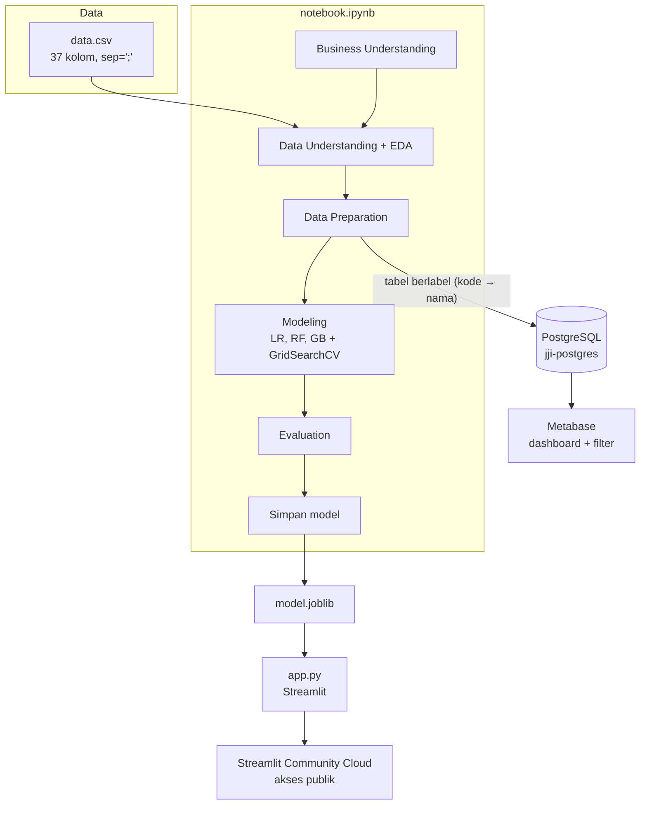

# Modul 1 — Gambaran Besar Proyek

> **Tujuan modul:** memahami *untuk apa* proyek ini dibuat, *apa saja* hasilnya, dan *bagaimana* semua bagiannya saling terhubung — sebelum masuk ke detail teknis.

---

## 1.1 Cerita bisnisnya

**Jaya Jaya Institut** (fiktif) adalah perguruan tinggi yang berdiri sejak tahun 2000. Reputasinya baik, tetapi banyak mahasiswa yang **tidak menyelesaikan studinya (dropout)**.

Kenapa dropout adalah masalah besar?

| Pihak | Kerugian |
|---|---|
| Institusi | Kehilangan pendapatan biaya kuliah, nilai akreditasi turun, reputasi menurun |
| Mahasiswa | Waktu dan biaya terbuang, peluang karier berkurang |
| Masyarakat | Investasi pendidikan tidak menghasilkan lulusan |

Institusi meminta dua hal:
1. **Deteksi sedini mungkin** mahasiswa yang berisiko dropout → supaya bisa diberi **bimbingan khusus**.
2. **Dashboard** → supaya pihak institusi mudah memahami data dan **memonitor performa** mahasiswa.

## 1.2 Pertanyaan bisnis yang dijawab

1. Seberapa besar tingkat dropout? → **32,1%** (hampir 1 dari 3 mahasiswa).
2. Faktor apa yang paling berkaitan dengan dropout? → **akademik** (mata kuliah lulus & nilai), **finansial** (biaya kuliah, tunggakan, beasiswa), **profil pendaftaran** (usia, jalur masuk, prodi, kelas malam).
3. Bagaimana mendeteksi mahasiswa berisiko? → **model Logistic Regression** dengan recall 83%.
4. Bagaimana memonitor secara berkala? → **dashboard Metabase** dengan filter interaktif.

> 💡 **Pelajaran penting:** proyek data science selalu dimulai dari **pertanyaan bisnis**, bukan dari algoritma. Algoritma hanyalah alat untuk menjawab pertanyaan.

## 1.3 Hasil akhir (deliverables)

| Deliverable | File / lokasi | Menjawab pertanyaan nomor |
|---|---|---|
| Analisis data & model | `notebook.ipynb` | 1, 2, 3 |
| Model siap pakai | `model/model.joblib` + `model/model_metadata.json` | 3 |
| Aplikasi prediksi | `app.py` → https://jaya-jaya-institut-do.streamlit.app | 3 |
| Dashboard monitoring | Metabase → `metabase.db.mv.db`, screenshot `andi_arif_abdillah-dashboard.png` | 1, 2, 4 |
| Dokumentasi, kesimpulan, rekomendasi | `README.md` | semua |
| Video presentasi | `andi_arif_abdillah-video.mp4` (tidak diunggah ke GitHub) | ringkasan |

## 1.4 Alur end-to-end



## 1.5 Kerangka kerja: CRISP-DM

Notebook mengikuti tahapan standar industri **CRISP-DM** (Cross-Industry Standard Process for Data Mining):

| Tahap CRISP-DM | Di proyek ini | Bagian notebook |
|---|---|---|
| 1. Business Understanding | Masalah dropout, tujuan, metrik keberhasilan | *Business Understanding* |
| 2. Data Understanding | Struktur data, kualitas, EDA 8 grafik | *Data Understanding* |
| 3. Data Preparation | Target biner, seleksi 19 fitur, split, pipeline | *Data Preparation / Preprocessing* |
| 4. Modeling | 3 algoritma dituning dengan GridSearchCV | *Modeling* |
| 5. Evaluation | Metrik, confusion matrix, ROC, permutation importance | *Evaluation* |
| 6. Deployment | Streamlit Cloud + dashboard Metabase | `app.py`, Metabase |

Tahapan ini **tidak selalu lurus**. Contoh nyata di proyek ini: saat EDA ditemukan bahwa kolom makroekonomi tidak membedakan status mahasiswa → keputusan itu dipakai kembali saat seleksi fitur.

## 1.6 Peta file repository

```
├── belajar/                      ← materi belajar ini
├── model/
│   ├── model.joblib              ← pipeline (preprocessing + Logistic Regression) yang sudah dilatih
│   └── model_metadata.json       ← daftar fitur, metrik, threshold, confusion matrix, dll.
├── notebook.ipynb                ← seluruh proses data science (sudah dijalankan)
├── app.py                        ← aplikasi Streamlit
├── data.csv                      ← dataset asli (pemisah ';')
├── sample_students.csv           ← 30 mahasiswa dari data uji untuk demo prediksi batch
├── metabase.db.mv.db             ← "otak" Metabase: berisi definisi dashboard, pertanyaan, akun
├── andi_arif_abdillah-dashboard.png ← screenshot dashboard
├── requirements.txt              ← daftar library + versi (dipakai Streamlit Cloud)
└── README.md                     ← dokumentasi utama proyek
```

## 1.7 Keputusan-keputusan kunci (dan alasannya)

Ini ringkasan — detailnya ada di modul-modul berikutnya. Usahakan Anda bisa menjelaskan **setiap baris** tabel ini setelah menyelesaikan materi.

| Keputusan | Alasan singkat | Modul |
|---|---|---|
| Target biner: Dropout vs Tidak Dropout | Pertanyaan bisnisnya "siapa yang akan dropout?", bukan "lulus tepat waktu atau tidak" | 5 |
| Pakai 19 dari 36 fitur | Performa setara (F1 0,795 vs 0,795), lebih sederhana, praktis diinput di aplikasi | 5 |
| `Course` & `Application_mode` di-one-hot | Kodenya label, bukan angka yang punya urutan | 3, 5 |
| `class_weight="balanced"` | Kelas tidak seimbang (32% vs 68%) | 6 |
| Metrik utama F1 & Recall, bukan akurasi | Melewatkan mahasiswa berisiko lebih mahal daripada salah memberi peringatan | 7 |
| Memilih model berdasarkan **CV F1**, bukan skor data uji | Agar pemilihan model tidak "mengintip" data uji | 7 |
| Logistic Regression terpilih | CV F1 tertinggi (0,793), recall tertinggi, mudah dijelaskan | 6, 7 |
| Threshold 0,5 + 3 level risiko | Sederhana; level Sedang menjembatani ketidakpastian | 7, 8 |
| Preprocessing dibungkus dalam `Pipeline` | Mencegah data leakage & aplikasi cukup memberi data mentah | 5, 8 |
| Dashboard pakai SQL native + filter | Fleksibel, setiap grafik bisa difilter per prodi/gender/waktu kuliah/beasiswa | 9 |

---

## ✍️ Cek pemahaman

1. Sebutkan dua permintaan Jaya Jaya Institut dalam proyek ini.
2. Apa bedanya *deliverable* notebook dengan aplikasi Streamlit dari sudut pandang pengguna?
3. Di tahap CRISP-DM mana keputusan "menggunakan recall sebagai metrik utama" seharusnya **pertama kali** ditetapkan?

<details>
<summary>Lihat jawaban</summary>

1. (a) Mendeteksi sedini mungkin mahasiswa yang berisiko dropout agar diberi bimbingan khusus; (b) dashboard untuk memahami data dan memonitor performa mahasiswa.
2. Notebook ditujukan untuk analis/data scientist (menjelaskan proses dan bukti); aplikasi Streamlit ditujukan untuk **staf akademik** yang tidak perlu tahu kode — cukup mengisi form dan membaca hasil.
3. Di **Business Understanding** (bagian *Metrik Keberhasilan*). Metrik harus ditentukan dari kebutuhan bisnis *sebelum* modeling, supaya model tidak dipilih berdasarkan angka yang kebetulan paling bagus.
</details>

➡️ Lanjut ke [Modul 2 — Fondasi Python & pandas](02-fondasi-python-pandas.md)
