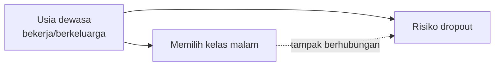

# Modul 4 — Statistik & Exploratory Data Analysis (EDA)

> **Tujuan modul:** memahami konsep statistik di balik setiap grafik EDA, membaca grafik dengan benar, dan — yang paling penting — **berpikir kritis** terhadap temuan.

## 4.0 Mengingat kembali: apa itu EDA?

**EDA (Exploratory Data Analysis)** adalah proses "berkenalan" dengan data lewat **ringkasan angka dan visualisasi**, dilakukan **sebelum** membuat model. Seperti dokter yang memeriksa pasien sebelum memberi obat, EDA memastikan kita memahami data sebelum mengambil keputusan dengannya.

**Enam tujuannya:** memahami struktur, memeriksa kualitas, memahami distribusi, menemukan hubungan, menemukan anomali, dan membangun hipotesis untuk langkah berikutnya.

**Tiga jenis analisisnya:**

| Jenis | Melihat | Contoh di notebook |
|---|---|---|
| Univariat | 1 variabel | distribusi status, histogram usia |
| Bivariat | 2 variabel | tingkat dropout per status pembayaran, boxplot nilai per status |
| Multivariat | ≥ 3 variabel | kelas malam × usia × dropout (bagian 4.5) |

**Hasil akhir EDA bukan grafik, melainkan insight**: *temuan + angka + perbandingan + implikasi*.

> 📘 Penjelasan lengkap (definisi, analogi, EDA vs CDA, checklist 10 langkah, kesalahan umum) ada di [Modul 0 — bagian EDA](00-konsep-dasar-data-science.md#04--apa-itu-eda-exploratory-data-analysis). Baca bagian itu dulu jika konsep EDA masih terasa samar.

Modul ini membahas **statistik yang dipakai** di balik setiap grafik EDA proyek, cara **membacanya**, dan cara **berpikir kritis** terhadap temuannya.

---

## 4.1 Statistik deskriptif

| Ukuran | Arti | Kapan dipakai |
|---|---|---|
| **Mean** (rata-rata) | jumlah ÷ banyak data | data simetris |
| **Median** | nilai tengah setelah diurutkan | data miring/ada outlier |
| **Std** (standar deviasi) | seberapa jauh data menyebar dari mean | mengukur variasi |
| **Kuartil** Q1, Q2, Q3 | nilai di posisi 25%, 50%, 75% | ringkasan sebaran |
| **IQR** | Q3 − Q1 | lebar 50% data tengah |

**Contoh dari proyek:** rata-rata nilai semester 2 mahasiswa dropout adalah **5,9**, tetapi **mediannya 0**. Artinya lebih dari separuh mahasiswa dropout tidak lulus satu mata kuliah pun di semester 2. Median menceritakan hal yang tersembunyi di balik mean.

### Membaca boxplot (grafik bagian 4 di notebook)

```
      ┬   ← whisker atas: nilai terbesar yang masih ≤ Q3 + 1,5×IQR
     ┌┴┐
     │ │  ← Q3 (75%)
     ├─┤  ← median (garis tengah)
     │ │  ← Q1 (25%)
     └┬┘
      ┴   ← whisker bawah
      •   ← titik = outlier (di luar 1,5×IQR)
```

Pada boxplot "rata-rata nilai semester 2", kotak mahasiswa **Dropout** menempel di angka 0, sedangkan kotak **Graduate** berada di sekitar 12–14. Kedua kelompok sangat jelas terpisah.

## 4.2 Jumlah vs tingkat (rate): kenapa semua grafik memakai persentase

Membandingkan **jumlah** dropout antar kelompok itu menyesatkan kalau ukuran kelompoknya berbeda:

| Kelompok | Jumlah dropout | Jumlah mahasiswa | **Tingkat dropout** |
|---|---|---|---|
| Biaya tidak lunas | 457 | 528 | **86,6%** |
| Biaya lunas | 964 | 3.896 | **24,7%** |

Dari jumlahnya, kelompok "lunas" menyumbang dropout lebih banyak. Tapi **risikonya** jauh lebih kecil. Pertanyaan bisnis kita adalah soal *risiko*, jadi yang dipakai adalah **tingkat (rate) = jumlah dropout ÷ jumlah mahasiswa di kelompok itu**.

Di notebook, setiap grafik tingkat dropout diberi **garis putus-putus di 32%** (rata-rata keseluruhan) dan warna **oranye untuk kelompok di atas rata-rata**. Dengan begitu mata langsung tertuju pada kelompok yang berisiko.

## 4.3 Hati-hati dengan kelompok kecil: ketidakpastian

Prodi *Biofuel Production Technologies* punya tingkat dropout **67%**, tertinggi. Tapi prodi itu hanya berisi **12 mahasiswa**.

Seberapa yakin kita? *Standard error* (SE) sebuah proporsi dihitung dengan:

$$SE = \sqrt{\frac{p(1-p)}{n}}$$

Rentang kepercayaan 95% ≈ p ± 1,96 × SE:

| Kelompok | p | n | Rentang 95% |
|---|---|---|---|
| Biofuel | 66,7% | 12 | **±26,7%** → antara 40% dan 93% |
| Informatics Engineering | 54,1% | 170 | ±7,5% |
| Nursing | 15,4% | 766 | ±2,6% |

Angka 67% untuk Biofuel sangat tidak pasti. Karena itu kesimpulan di README menyebut Equinculture, Informatics Engineering, dan Management (evening) sebagai prodi berisiko, dan memberi catatan bahwa Biofuel "hanya berisi 12 mahasiswa". Grafik jalur pendaftaran di notebook juga hanya menampilkan kelompok dengan **n ≥ 70**, dan di dashboard **n ≥ 30**.

## 4.4 Korelasi

**Korelasi Pearson (r)** mengukur seberapa kuat dua variabel bergerak **linier** bersama. Nilainya dari −1 sampai +1.

$$r = \frac{\sum (x_i - \bar{x})(y_i - \bar{y})}{\sqrt{\sum (x_i-\bar{x})^2}\sqrt{\sum (y_i-\bar{y})^2}}$$

| r | Tafsiran kasar |
|---|---|
| 0,0–0,1 | hampir tidak ada |
| 0,1–0,3 | lemah |
| 0,3–0,5 | sedang |
| > 0,5 | kuat |

Jika salah satu variabel biner (seperti `is_dropout`), korelasi Pearson disebut **point-biserial**. Rumusnya sama, dan hasilnya dibaca sebagai "seberapa berbeda rata-rata X antara dropout dan tidak".

**Korelasi terhadap `is_dropout` (grafik bagian 8):**

| Fitur | r |
|---|---|
| Approval rate semester 2 | **−0,66** |
| Rata-rata nilai semester 2 | −0,57 |
| Mata kuliah lulus semester 2 | −0,57 |
| Biaya kuliah lunas | −0,43 |
| Beasiswa | −0,25 |
| Usia saat mendaftar | +0,25 |
| Debtor | +0,23 |
| Gender (laki-laki) | +0,20 |

Tanda negatif artinya "semakin tinggi nilai fitur, semakin kecil peluang dropout".

### ⚠️ Tiga peringatan tentang korelasi
1. **Hanya untuk data numerik/biner.** Ingat jebakan `Course` dan `Application_mode` di [Modul 3](03-memahami-data.md).
2. **Hanya menangkap hubungan linier.** Hubungan berbentuk kurva bisa terbaca mendekati 0.
3. **Korelasi ≠ sebab-akibat.** Pembahasannya di bagian berikut.

## 4.5 Confounding: saat data "berbohong" 🕵️

Notebook dan README menyebut **kelas malam** lebih berisiko (43% vs 31%). Coba kita pecah per kelompok usia:

| Kelompok usia | Kelas malam | Kelas siang |
|---|---|---|
| ≤ 20 tahun | 22,7% (n=22) | 21,2% (n=2.529) |
| > 20 tahun | **43,8%** (n=461) | **47,9%** (n=1.412) |

Di **usia yang sama**, kelas malam **tidak** lebih berisiko. Pada mahasiswa di atas 20 tahun, kelas malam malah sedikit lebih rendah risikonya. Lalu kenapa secara keseluruhan tampak lebih tinggi? Karena **rata-rata usia kelas malam 33 tahun, sedangkan kelas siang 22 tahun**. Yang sebenarnya berkaitan dengan dropout adalah **usia** (atau hal-hal yang menyertai usia: bekerja, berkeluarga). Kelas malam hanya "ikut terbawa".

Variabel seperti usia di sini disebut **confounder (perancu)**, yaitu variabel ketiga yang memengaruhi dua variabel lain sekaligus.



Pola yang sama terjadi pada **mahasiswa perantau (displaced)**. Mereka tampak lebih jarang dropout (28% vs 38%), padahal rata-rata usianya 20,8 tahun dibanding 26,3 tahun untuk yang bukan perantau.

**Pelajaran:** sebelum menyimpulkan "X menyebabkan dropout", selalu tanyakan: *"adakah variabel lain yang bisa menjelaskan hubungan ini?"* Rekomendasi "jadwal fleksibel untuk mahasiswa dewasa & kelas malam" tetap masuk akal karena targetnya **mahasiswa dewasa**. Tapi penyebab yang lebih tepat adalah usia dan kondisi hidupnya, bukan jam kuliahnya.

## 4.6 Membaca 8 grafik EDA di notebook

| # | Grafik | Cara membaca | Insight utama |
|---|---|---|---|
| 1 | Distribusi status (batang horizontal) | panjang batang = jumlah | 32,1% dropout; kelas tidak seimbang |
| 2 | Tingkat dropout per kelompok (6 panel) | oranye = di atas rata-rata 32% | Tidak lunas 87%, debtor 62%, beasiswa hanya 12% |
| 3 | Usia (histogram bertumpuk + batang) | histogram: sebaran usia; batang: risiko per kelompok usia | ≤20 tahun: 21%; 25–30 tahun: 58% |
| 4 | Performa akademik (4 boxplot) | posisi kotak = sebaran nilai | Dropout: lulus 1,9 MK di semester 2 vs Graduate 6,2 |
| 5 | Approval rate semester 2 (batang bertumpuk 100%) | tiap baris = 100%, warna = komposisi status | 0% lulus → 84% dropout; 100% lulus → 6% |
| 6 | Program studi & jalur pendaftaran (batang horizontal terurut) | diurutkan dari risiko terendah ke tertinggi | Equinculture 55%, Informatics 54%, Nursing 15% |
| 7 | Makroekonomi (boxplot) | kotak sejajar = tidak ada perbedaan | Tidak membedakan status → tidak dipakai di model |
| 8 | Korelasi (batang ±) | biru = menurunkan risiko, oranye = menaikkan | Sinyal akademik & finansial terkuat |

## 4.7 Prinsip visualisasi yang dipakai

1. **Judul berupa kesimpulan**, bukan sekadar deskripsi. Contohnya "Hampir 1 dari 3 mahasiswa dropout (32,1%)", bukan "Distribusi Status".
2. **Warna punya arti yang konsisten** di notebook, dashboard, dan PPT: oranye = Dropout, biru = Graduate, hijau = Enrolled.
3. **Garis acuan** (rata-rata 32%) membantu membandingkan.
4. **Label n** di setiap batang, supaya pembaca tahu seberapa besar kelompoknya.
5. **Diurutkan** dari kecil ke besar, supaya peringkat mudah dibaca.
6. **Batang bertumpuk 100%** untuk komposisi, **batang biasa** untuk membandingkan tingkat.
7. Elemen dekoratif dikurangi: tanpa garis tepi atas dan kanan, dengan grid tipis.

---

## ✍️ Cek pemahaman

1. Kenapa median nilai semester 2 mahasiswa dropout (0) lebih informatif daripada meannya (5,9)?
2. Sebuah prodi berisi 20 mahasiswa dengan 12 dropout (60%). Hitung rentang kepercayaan 95%-nya.
3. Jelaskan dengan kata-kata sendiri kenapa "kelas malam" belum tentu penyebab dropout.
4. Korelasi usia dengan dropout adalah +0,25. Apakah artinya "setiap tambahan 1 tahun menambah risiko 25%"?

<details>
<summary>Lihat jawaban</summary>

1. Mean terangkat oleh sebagian mahasiswa dropout yang nilainya bagus. Median = 0 menunjukkan bahwa **mayoritas** mahasiswa dropout tidak lulus apa pun di semester 2. Sinyalnya sangat tegas.
2. SE = √(0,6 × 0,4 / 20) = √0,012 ≈ 0,110 → ±1,96 × 0,110 ≈ **±21,5%**, jadi rentangnya sekitar 38,5% sampai 81,5%. Terlalu lebar untuk disimpulkan.
3. Mahasiswa kelas malam rata-rata jauh lebih tua. Setelah dibandingkan pada kelompok usia yang sama, risikonya tidak lebih tinggi. Usia (dan kondisi hidup yang menyertainya) adalah confounder.
4. Bukan. r mengukur kekuatan hubungan linier (−1 sampai 1), bukan besarnya efek per satuan. Besarnya efek per satuan diukur dengan koefisien model ([Modul 6](06-machine-learning.md)).
</details>

➡️ Lanjut ke [Modul 5 — Persiapan data](05-persiapan-data.md)
