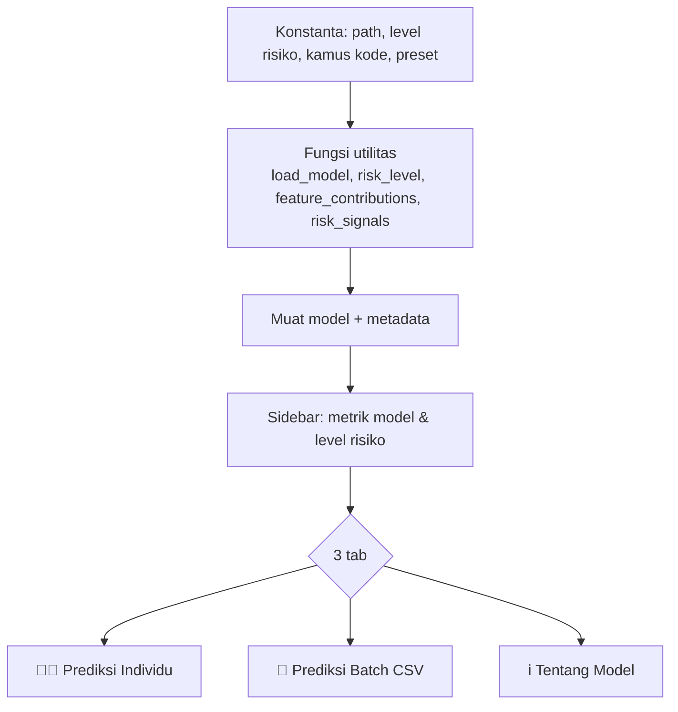
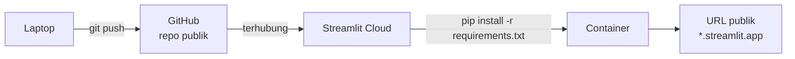

# Modul 8 — Aplikasi Streamlit & Deployment

> **Tujuan modul:** memahami cara kerja Streamlit, membedah `app.py` bagian demi bagian, memahami cara aplikasi "menjelaskan" prediksinya, dan memahami proses deployment beserta masalah-masalah yang terjadi.

Buka `app.py` di samping modul ini.

---

## 8.1 Cara kerja Streamlit: "jalankan ulang dari atas"

Streamlit mengubah skrip Python biasa menjadi aplikasi web. Aturan terpentingnya:

> **Setiap kali pengguna berinteraksi (klik tombol, ganti isian), seluruh skrip dijalankan ulang dari baris pertama sampai terakhir.**

Konsekuensinya:
1. Operasi berat (memuat model, membaca CSV) harus **di-cache** supaya tidak diulang setiap klik.
2. Nilai yang harus "diingat" antar-rerun disimpan di **`st.session_state`**.
3. Supaya aplikasi tidak rerun setiap kali satu isian diganti, isian dikumpulkan dalam **`st.form`** dan baru diproses saat tombol submit ditekan.

## 8.2 Struktur `app.py`



### Path yang aman
```python
BASE_DIR = Path(__file__).parent
MODEL_PATH = BASE_DIR / "model" / "model.joblib"
```
Path dihitung relatif terhadap **lokasi file `app.py`**, bukan folder tempat perintah dijalankan. Karena itu aplikasi tetap menemukan modelnya baik dijalankan di laptop maupun di Streamlit Cloud.

### Caching
```python
@st.cache_resource
def load_model():
    return joblib.load(MODEL_PATH)

@st.cache_data
def load_metadata():
    return json.loads(METADATA_PATH.read_text())
```

| Dekorator | Untuk | Perilaku |
|---|---|---|
| `st.cache_resource` | objek "sumber daya" (model, koneksi) | satu objek dipakai bersama oleh semua pengguna |
| `st.cache_data` | data (DataFrame, dict) | hasilnya disalin untuk setiap pemanggilan, jadi aman diubah |

```python
@st.cache_resource
def reference_mean(_model, features): ...
```
Parameter berawalan **underscore** (`_model`) memberi tahu Streamlit untuk **tidak meng-hash** argumen itu. Model adalah objek besar yang tidak perlu dan tidak praktis untuk di-hash.

## 8.3 Tab Prediksi Individu

### Tombol contoh (preset) dan `session_state`
```python
def apply_preset(name):
    for key, value in PRESETS[name].items():
        st.session_state[key] = value

p1.button("Isi contoh risiko tinggi", on_click=apply_preset, args=("high",))
```
Setiap isian form punya `key` (misalnya `key="Course"`), sehingga nilainya tersimpan di `st.session_state["Course"]`. Fungsi `on_click` dijalankan **sebelum** rerun. Jadi saat form digambar ulang, isiannya sudah berisi nilai preset.

```python
for key, value in PRESETS["low"].items():
    st.session_state.setdefault(key, value)
```
`setdefault` mengisi nilai awal **hanya jika belum ada**, sehingga pilihan pengguna tidak tertimpa di setiap rerun.

### Form dan validasi
```python
with st.form("student_form"):
    course = c1.selectbox("Program studi", sorted(COURSE_MAP, key=COURSE_MAP.get),
                          format_func=COURSE_MAP.get, key="Course")
    ...
    submitted = st.form_submit_button("🔍 Prediksi risiko dropout")
```
- `format_func=COURSE_MAP.get`: pengguna melihat **nama** prodi, tetapi nilai yang tersimpan tetap **kode** yang dibutuhkan model.
- Validasi logika: jumlah MK lulus tidak boleh melebihi MK diambil. Jika dilanggar, aplikasi menampilkan `st.error` lalu `st.stop()`.

### Membentuk input dan memprediksi
```python
row = pd.DataFrame([{ "Application_mode": application_mode, "Course": course, ... }])[FEATURES]
probability = float(model.predict_proba(row[FEATURES])[:, 1][0])
```
`[FEATURES]` memastikan **urutan kolom** sama persis dengan saat model dilatih. Daftar fitur diambil dari `model_metadata.json`, jadi aplikasi dan notebook selalu sinkron.

### Level risiko
```python
RISK_LEVELS = [(0.50, "Tinggi", ...), (0.30, "Sedang", ...), (0.00, "Rendah", ...)]
```
Fungsi `risk_level` memeriksa dari batas tertinggi ke terendah dan mengembalikan level pertama yang terpenuhi.

## 8.4 Bagaimana aplikasi "menjelaskan" prediksinya

Grafik "Faktor yang paling memengaruhi prediksi" dihitung oleh `feature_contributions`:

$$\text{kontribusi}_i = w_i \times (x_i^{\text{std}} - \bar{x}_i^{\text{std}})$$

- $x_i^{\text{std}}$ = nilai fitur mahasiswa ini setelah preprocessing (one-hot + scaling)
- $\bar{x}_i^{\text{std}}$ = rata-rata nilai fitur itu pada **seluruh data** (`reference_mean`), yaitu "mahasiswa rata-rata"
- $w_i$ = koefisien Logistic Regression

Hasilnya menjawab pertanyaan: *"dibanding mahasiswa rata-rata, fitur mana yang mendorong log-odds mahasiswa ini naik (oranye) atau turun (biru)?"*

Kolom one-hot dijumlahkan kembali ke fitur asalnya. Misalnya `categorical__Course_9119` dan kolom-kolom Course lainnya menjadi satu batang "Program studi":
```python
original = next(f for f in features if name.split("__", 1)[1].startswith(f))
grouped[original] = grouped.get(original, 0.0) + value
```

> 💡 Penjelasan seperti ini hanya "jujur" karena modelnya **linier**. Untuk model non-linier (Random Forest), dibutuhkan teknik lain seperti SHAP. Ini salah satu keuntungan praktis memilih Logistic Regression.

### Sinyal risiko & rekomendasi: aturan, bukan model
`risk_signals` adalah **aturan manual** (if-else). Contohnya: jika biaya kuliah belum lunas, tampilkan "Tawarkan skema cicilan". Model menghasilkan **seberapa besar** risikonya, sedangkan aturan menerjemahkannya menjadi **tindakan konkret** yang bisa langsung dikerjakan staf. Kombinasi model + aturan bisnis seperti ini sangat umum di industri.

## 8.5 Tab Prediksi Batch

```python
batch = pd.read_csv(uploaded, sep=None, engine="python")
```
`sep=None` + `engine="python"`: pandas **menebak sendiri** pemisahnya (koma atau titik koma). Ini berguna karena pengguna Excel di Indonesia sering menyimpan CSV dengan titik koma.

Alurnya:
1. Periksa apakah semua 19 kolom ada. Jika tidak, tampilkan kolom yang hilang.
2. Hitung probabilitas, level risiko, dan prediksi untuk setiap baris.
3. **Urutkan dari probabilitas tertinggi** supaya staf langsung melihat siapa yang perlu didahulukan.
4. Tampilkan ringkasan (metric + grafik), tabel dengan `ProgressColumn`, dan tombol unduh hasil.

Dengan contoh 30 mahasiswa (`sample_students.csv`): **8 risiko tinggi, 7 sedang, 15 rendah.**

## 8.6 Tab Tentang Model
Semua angka (metrik, perbandingan model, confusion matrix, permutation importance) dibaca dari `model_metadata.json`. Jika model dilatih ulang, tab ini ikut berubah tanpa mengubah kode aplikasi.

---

## 8.7 Menjalankan secara lokal

```bash
python -m streamlit run app.py
```

⚠️ **Bukan** `python app.py`. Streamlit harus dijalankan lewat perintahnya sendiri.

**Masalah nyata yang pernah terjadi:** VS Code menjalankan `app.py` dengan Python 3.14, sehingga muncul `ModuleNotFoundError: No module named 'altair'`. Library proyek hanya terpasang di Python 3.10. Pelajarannya: **setiap instalasi Python punya kumpulan library sendiri.** Selalu periksa interpreter yang dipakai (VS Code: `Ctrl+Shift+P` → *Python: Select Interpreter*), atau gunakan virtual environment.

## 8.8 Deployment ke Streamlit Community Cloud



1. Kode di-push ke GitHub: https://github.com/AndiArifAbdillah/jaya-jaya-institut-dropout
2. Di share.streamlit.io: **Create app** → pilih repo, branch `main`, file `app.py`.
3. Streamlit Cloud membuat container, meng-install `requirements.txt`, lalu menjalankan aplikasi.

### Kenapa versi library di-*pin* (`scikit-learn==1.7.2`)?
`model.joblib` adalah objek Python yang di-*pickle*. Objek ini **terikat pada versi scikit-learn** yang membuatnya. Jika versi di server berbeda, model bisa gagal dimuat atau memberi peringatan dan hasil yang tidak konsisten. Mem-pin versi menjamin lingkungan server **sama** dengan lingkungan pelatihan.

### Masalah nyata: build macet di Python 3.14
Log deploy menunjukkan `Using Python 3.14.7`. Versi yang di-pin (misalnya `numpy==2.2.6`) belum menyediakan paket siap pakai (*wheel*) untuk Python 3.14, sehingga server mencoba meng-compile dari kode sumber dan macet lama di "Processing dependencies". Solusinya adalah deploy ulang dengan **Python 3.11** di *Advanced settings*.

> Pelajaran: **versi Python adalah bagian dari environment**, sama pentingnya dengan versi library.

### Aplikasi "tidur"
Aplikasi gratis di Streamlit Cloud otomatis tidur jika lama tidak diakses. Pengunjung cukup klik **"Yes, get this app back up!"**. Catatan ini sudah ditulis di README untuk reviewer.

### Publik atau privat?
Di **Settings → Sharing**, pilih *This app is public and searchable*. Catatan teknis: `curl` biasa selalu mendapat `HTTP 303` ke `share.streamlit.io/-/auth/app`, **bahkan untuk aplikasi publik**, karena itu proses pemasangan cookie. Untuk memastikan aplikasi benar-benar publik, buka di jendela **Incognito**.

---

## ✍️ Cek pemahaman

1. Apa yang terjadi di Streamlit ketika pengguna menekan tombol "Isi contoh risiko tinggi"? Jelaskan urutannya.
2. Kenapa isian dibungkus `st.form`?
3. Apa beda `st.cache_resource` dan `st.cache_data`? Mana yang cocok untuk model?
4. Kenapa aplikasi membaca daftar fitur dari `model_metadata.json`, tidak menuliskannya langsung di kode?
5. Jelaskan dengan kata-kata sendiri cara menghitung "kontribusi" pada grafik penjelasan.

<details>
<summary>Lihat jawaban</summary>

1. Callback `apply_preset("high")` menulis nilai preset ke `st.session_state`. Lalu seluruh skrip dijalankan ulang, dan setiap isian (yang punya `key`) membaca nilainya dari session_state, sehingga form terlihat terisi.
2. Supaya aplikasi tidak rerun setiap kali satu isian diganti. Semua isian baru diproses bersama saat tombol submit ditekan.
3. `cache_resource` menyimpan satu objek yang dipakai bersama (cocok untuk model). `cache_data` menyimpan data dan memberi salinan setiap kali dipanggil.
4. Supaya urutan dan nama fitur selalu sama dengan saat pelatihan. Jika model dilatih ulang dengan fitur berbeda, aplikasi ikut menyesuaikan.
5. Nilai fitur mahasiswa (yang sudah distandardisasi) dikurangi rata-rata seluruh mahasiswa, lalu dikalikan koefisien model. Hasilnya menunjukkan seberapa besar fitur itu menaikkan atau menurunkan skor risiko dibanding mahasiswa rata-rata.
</details>

➡️ Lanjut ke [Modul 9 — Dashboard Metabase, SQL & Docker](09-dashboard-metabase.md)
