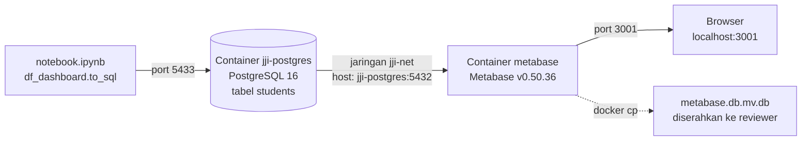

# Modul 9 — Dashboard Metabase, SQL & Docker

> **Tujuan modul:** memahami infrastruktur di balik dashboard (Docker, PostgreSQL, Metabase), menulis query SQL analitik yang dipakai setiap grafik, dan memahami cara kerja filter interaktif.

---

## 9.1 Arsitektur



## 9.2 Docker dalam 5 menit

| Istilah | Analogi | Di proyek ini |
|---|---|---|
| **Image** | "cetakan" / resep | `postgres:16-alpine`, `metabase/metabase:v0.50.36` |
| **Container** | "kue" hasil cetakan yang sedang berjalan | `jji-postgres`, `metabase` |
| **Port mapping** `-p A:B` | pintu dari laptop (A) ke dalam container (B) | `5433:5432` (Postgres), `3001:3000` (Metabase) |
| **Network** | jaringan pribadi antar-container | `jji-net`: Metabase menghubungi Postgres lewat nama `jji-postgres` |

Kenapa port **5433** dan **3001**, bukan port default (5432 dan 3000)? Karena di laptop ini port 5432 sudah dipakai database lain dan port 3000 sudah dipakai aplikasi lain. Port mapping membuat kita bebas memilih pintu di sisi laptop tanpa mengubah apa pun di dalam container.

Perintah-perintah yang dipakai:

```bash
docker network create jji-net
docker run -d --name jji-postgres --network jji-net -e POSTGRES_PASSWORD=root123 -e POSTGRES_DB=jaya_jaya_institut -p 5433:5432 postgres:16-alpine
docker run -d --name metabase --network jji-net -p 3001:3000 metabase/metabase:v0.50.36
docker start jji-postgres metabase        # menyalakan lagi setelah laptop restart
docker cp metabase:/metabase.db/metabase.db.mv.db ./   # mengekspor "otak" Metabase
```

> ⚠️ **Urutan penting:** buka **Docker Desktop** dulu dan tunggu status *Engine running*, baru jalankan perintah `docker`. Error `failed to connect to the docker API ... dockerDesktopLinuxEngine` artinya engine-nya belum hidup.

**Masalah nyata yang pernah terjadi:** Docker Desktop crash dengan pesan `...dockerInference: The file cannot be accessed by the system`. Penyebabnya adalah file *socket* sisa crash sebelumnya di `AppData\Local\Docker\run` dan `AppData\Local\docker-secrets-engine`. Solusinya: tutup paksa semua proses Docker, ganti nama kedua folder itu, lalu jalankan ulang. **Jangan pernah klik "Reset to factory defaults"**, karena itu menghapus semua container dan image.

## 9.3 Metabase: konsep inti

| Konsep | Arti |
|---|---|
| **Database connection** | Metabase terhubung ke PostgreSQL (host `jji-postgres`, port 5432) |
| **Question / Card** | satu query + satu visualisasi (misalnya "Tingkat Dropout per Program Studi") |
| **Native query** | question yang ditulis dengan SQL langsung |
| **Dashboard** | kumpulan card yang disusun di grid 24 kolom |
| **Filter (parameter)** | kontrol di atas dashboard; setiap filter dihubungkan ke card-card |
| **Application database** | database internal Metabase yang menyimpan akun, question, dan dashboard → file `metabase.db.mv.db` (format H2) |

> ⚠️ `metabase.db.mv.db` **tidak berisi data mahasiswa**, hanya definisi dashboard dan alamat koneksi ke PostgreSQL. Karena itu reviewer yang hanya memuat file ini akan melihat dashboard tetapi grafiknya error sampai tabel `students` tersedia (langkahnya ada di README). Screenshot disertakan sebagai cadangan.

Dashboard proyek ini dibangun **lewat API Metabase** dengan skrip Python (lihat [lampiran/metabase_setup.py](lampiran/metabase_setup.py)), bukan diklik satu per satu. Keuntungannya: bisa diulang dan tersimpan sebagai kode (*dashboard as code*).

## 9.4 SQL untuk analitik: belajar dari query dashboard

Tabel `students` berisi satu baris per mahasiswa dengan kolom berlabel (`course`, `gender`, `status`, `is_dropout`, …).

### a) KPI: satu angka
```sql
SELECT COUNT(*) AS total_mahasiswa FROM students;                                  -- 4.424

SELECT AVG(CASE WHEN status = 'Dropout' THEN 1 ELSE 0 END)::float AS rate FROM students;  -- 0,321
```
- `COUNT(*)` menghitung baris.
- `CASE WHEN ... THEN 1 ELSE 0 END` membuat kolom 0/1 "on the fly".
- `AVG` dari 0/1 **= proporsi**, trik yang sama seperti di pandas ([Modul 2](02-fondasi-python-pandas.md)).
- `::float` mengubah tipe ke desimal, sintaks khusus PostgreSQL.

### b) Tingkat dropout per kelompok
```sql
SELECT course AS "Program studi",
       AVG(is_dropout)::float AS dropout_rate,
       COUNT(*)               AS jumlah_mahasiswa
FROM students
GROUP BY course
ORDER BY dropout_rate DESC;
```
Ini padanan SQL dari `df.groupby("course")["is_dropout"].agg(["mean", "size"])`.

### c) Menyaring kelompok kecil: `HAVING`
```sql
SELECT application_mode, AVG(is_dropout)::float AS dropout_rate, COUNT(*) AS jumlah_mahasiswa
FROM students
GROUP BY application_mode
HAVING COUNT(*) >= 30          -- hanya jalur dengan minimal 30 mahasiswa
ORDER BY dropout_rate DESC;
```
- `WHERE` menyaring **baris sebelum** dikelompokkan.
- `HAVING` menyaring **kelompok setelah** dihitung.

### d) Komposisi status (untuk batang bertumpuk 100%)
```sql
SELECT age_group, status, COUNT(*) AS jumlah
FROM students
GROUP BY age_group, status
ORDER BY CASE age_group WHEN '≤20' THEN 1 WHEN '21–24' THEN 2 WHEN '25–30' THEN 3
                        WHEN '31–40' THEN 4 ELSE 5 END;
```
`ORDER BY CASE ...` membuat urutan kustom. Tanpa itu, teks akan diurutkan secara alfabet ('21–24' muncul sebelum '≤20').

### e) Mengubah kolom menjadi baris: `UNION ALL`
Grafik "Rata-rata MK lulus per semester" butuh data berbentuk *(semester, status, nilai)*, padahal tabelnya menyimpan `sem1_approved` dan `sem2_approved` sebagai **dua kolom**:
```sql
SELECT semester, status, AVG(approved)::float AS rata_rata
FROM (
  SELECT status, 'Semester 1' AS semester, sem1_approved AS approved FROM students
  UNION ALL
  SELECT status, 'Semester 2',            sem2_approved             FROM students
) t
GROUP BY semester, status;
```
Teknik ini disebut **unpivot** (padanannya di pandas: `melt`). `UNION ALL` menumpuk hasil dua query tanpa membuang duplikat.

## 9.5 Filter interaktif: *field filter*

Setiap query dashboard sebenarnya berisi:
```sql
SELECT ... FROM students WHERE {{course}} AND {{gender}} AND {{attendance}} AND {{scholarship}} ...
```
`{{course}}` adalah **template tag** bertipe *field filter* yang terhubung ke kolom `students.course`.
- Jika filter **kosong**, Metabase mengganti `{{course}}` dengan `1=1` (selalu benar), jadi semua data ditampilkan.
- Jika pengguna memilih "Informatics Engineering", tag itu berubah menjadi `"public"."students"."course" = 'Informatics Engineering'`.

Keempat filter dihubungkan ke **semua** card lewat *parameter mappings*. Dengan satu klik, seluruh dashboard fokus pada satu segmen. Contoh: filter Informatics Engineering menampilkan **170 mahasiswa dengan tingkat dropout 54,1%**.

## 9.6 Desain dashboard

```
┌──────────────────────────────── Judul + petunjuk warna ───────────────────────────────┐
│ [Total 4.424] [Dropout 32,1%] [Lulus 49,9%] [Enrolled 17,9%]        ← KPI            │
│ [Donut status]        [Komposisi status per usia]                   ← ringkasan      │
│ ── Faktor Finansial ── [Biaya lunas?] [Debtor?] [Beasiswa?]                          │
│ ── Performa Akademik ── [MK lulus/smt] [Nilai/smt] [Approval rate smt 2]             │
│ ── Profil Pendaftaran ── [Dropout per prodi] [Dropout per jalur masuk]               │
│                          [Gender] [Waktu kuliah] [Status pernikahan]                  │
└───────────────────────────────────────────────────────────────────────────────────────┘
```

Prinsip yang diterapkan:
1. **Dari umum ke khusus**: KPI → ringkasan → faktor-faktor.
2. **Dikelompokkan per tema** dengan judul bagian (sesuai temuan EDA: finansial, akademik, profil).
3. **Warna konsisten**: oranye = dropout di semua grafik.
4. **Filter di atas** supaya satu kontrol mengubah semuanya.
5. **Kelompok kecil disaring** (`HAVING COUNT(*) >= 30`) supaya tidak menyesatkan.

---

## ✍️ Cek pemahaman

1. Apa beda image dan container?
2. Kenapa Metabase terhubung ke `jji-postgres:5432`, bukan `localhost:5433`?
3. Tulis query SQL untuk tingkat dropout per gender, hanya untuk mahasiswa penerima beasiswa.
4. Apa beda `WHERE` dan `HAVING`?
5. Reviewer membuka `metabase.db.mv.db` di laptopnya dan grafiknya error. Kenapa?

<details>
<summary>Lihat jawaban</summary>

1. Image adalah cetakan/resep yang tidak berjalan. Container adalah instance yang sedang berjalan dari image tersebut.
2. Metabase berjalan **di dalam** container. Dari dalam container, `localhost` berarti container itu sendiri. Kedua container berada di network `jji-net`, sehingga Metabase memanggil Postgres dengan nama containernya dan port internal 5432. Port 5433 hanya berlaku dari sisi laptop.
3. ```sql
   SELECT gender, AVG(is_dropout)::float AS dropout_rate, COUNT(*) AS n
   FROM students
   WHERE scholarship_holder = 'Yes'
   GROUP BY gender;
   ```
4. `WHERE` menyaring baris sebelum `GROUP BY`. `HAVING` menyaring hasil kelompok setelah agregasi.
5. File itu hanya berisi definisi dashboard dan alamat koneksi, bukan datanya. Database PostgreSQL berisi tabel `students` tidak ada di laptop reviewer.
</details>

➡️ Lanjut ke [Modul 10 — Bisnis, kesimpulan & etika](10-bisnis-kesimpulan-etika.md)
