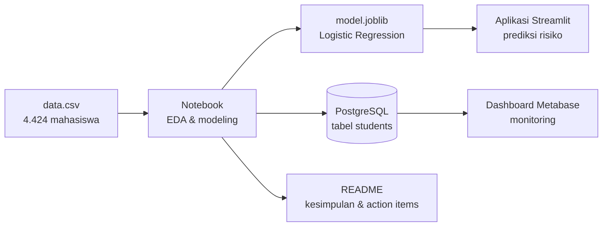

# 📚 Materi Belajar: Menguasai Proyek Jaya Jaya Institut dari Nol

Folder ini adalah **kurikulum belajar mandiri** untuk memahami proyek ini secara mendalam — mulai dari fondasi paling dasar (Python, statistik, konsep machine learning) sampai bisa **menjelaskan, mempertahankan, dan mengembangkan** setiap keputusan di proyek ini.

Targetnya sederhana: setelah menyelesaikan materi ini, Anda bisa menjawab pertanyaan *"kenapa begini?"* untuk **setiap baris** di notebook, aplikasi, dan dashboard — tanpa melihat catatan.

---

## 🎯 Tujuan proyek dalam satu paragraf

Jaya Jaya Institut kehilangan **32,1% mahasiswanya karena dropout** (1.421 dari 4.424). Proyek ini (1) **mencari tahu penyebabnya** lewat analisis data, (2) **membangun model machine learning** yang memprediksi mahasiswa berisiko dropout agar bisa dibimbing lebih awal, (3) menyediakan **dashboard** untuk memonitor performa mahasiswa, dan (4) memberikan **rekomendasi tindakan** yang bisa dijalankan institusi.



---

## 🗺️ Peta belajar

Kerjakan **berurutan**. Setiap modul membangun di atas modul sebelumnya.

| # | Modul | Yang akan Anda kuasai | Estimasi |
|---|---|---|---|
| 0 | [Konsep dasar data science](00-konsep-dasar-data-science.md) | **Mulai di sini jika pemula**: apa itu data science, **EDA secara mendalam**, fitur/target, model, overfitting, dashboard — dengan analogi sehari-hari | 1–1,5 jam |
| 1 | [Gambaran besar proyek](01-gambaran-besar-proyek.md) | Masalah bisnis, tujuan, alur end-to-end, fungsi tiap file | 30 menit |
| 2 | [Fondasi Python & pandas](02-fondasi-python-pandas.md) | Semua sintaks Python/pandas yang dipakai di proyek | 2–3 jam |
| 3 | [Memahami data](03-memahami-data.md) | Arti 37 kolom, tipe data, jebakan kolom berkode | 1 jam |
| 4 | [Statistik & EDA](04-statistik-dan-eda.md) | Statistik deskriptif, tingkat dropout, korelasi, membaca grafik | 2 jam |
| 5 | [Persiapan data](05-persiapan-data.md) | Target, seleksi fitur, split, encoding, scaling, pipeline, data leakage | 2 jam |
| 6 | [Machine learning](06-machine-learning.md) | Logistic Regression sampai rumusnya, Random Forest, Gradient Boosting, cross-validation | 3 jam |
| 7 | [Evaluasi model](07-evaluasi-model.md) | Confusion matrix, precision/recall/F1, ROC-AUC, threshold, feature importance | 2 jam |
| 8 | [Aplikasi Streamlit & deployment](08-aplikasi-streamlit.md) | Cara kerja Streamlit, bedah `app.py`, deploy ke Cloud | 2 jam |
| 9 | [Dashboard Metabase, SQL & Docker](09-dashboard-metabase.md) | Docker, PostgreSQL, SQL analitik, filter Metabase | 2 jam |
| 10 | [Bisnis, kesimpulan & etika](10-bisnis-kesimpulan-etika.md) | Dari insight ke action item, keterbatasan, fairness | 1 jam |
| 11 | [Latihan, kuis & simulasi review](11-latihan-dan-kuis.md) | 12 latihan praktik, 30 soal kuis, pertanyaan "sidang" | 3–5 jam |
| 📖 | [Glosarium](GLOSARIUM.md) | Kamus istilah — buka kapan saja | – |
| 📎 | [lampiran/metabase_setup.py](lampiran/metabase_setup.py) | Skrip yang membangun dashboard lewat API Metabase | – |

**Total ±21–26 jam** belajar aktif. Tidak perlu sekali duduk — 1 modul per hari sudah sangat baik.

---

## 🧭 Cara belajar yang disarankan

1. **Baca modul sambil membuka file aslinya.** Setiap modul menyebut lokasi kode di `notebook.ipynb` atau `app.py`. Buka berdampingan.
2. **Jalankan ulang kodenya sendiri.** Jangan hanya membaca — ubah angka, jalankan, lihat apa yang berubah.
3. **Jawab "Cek pemahaman" tanpa melihat jawaban** (jawaban disembunyikan dalam blok yang bisa diklik).
4. **Teknik Feynman:** setelah satu modul, jelaskan isinya dengan kata-kata Anda sendiri seolah mengajari teman yang belum pernah belajar data science. Bagian yang sulit dijelaskan = bagian yang belum dikuasai.
5. **Kerjakan latihan di modul 11.** Di sanalah pemahaman berubah menjadi keterampilan.

## 🛠️ Menyiapkan environment untuk praktik

```bash
python -m venv .venv
.venv\Scripts\activate
pip install -r requirements.txt jupyter
```

Lalu buka notebook:

```bash
jupyter notebook notebook.ipynb
```

> Di laptop pembuat proyek, library sudah terpasang di **Python 3.10**. Jika memakai Python lain (mis. 3.14), install ulang requirements terlebih dahulu — lihat [modul 8](08-aplikasi-streamlit.md#87-menjalankan-secara-lokal).

---

## ✅ Checklist penguasaan

Centang jika Anda bisa melakukannya **tanpa melihat catatan**:

- [ ] Menjelaskan apa itu EDA, tujuannya, dan 3 jenis analisisnya (univariat, bivariat, multivariat)
- [ ] Menjelaskan masalah bisnis dan tujuan proyek dalam 1 menit
- [ ] Menyebutkan 3 kelompok faktor utama dropout beserta angkanya
- [ ] Menjelaskan kenapa target dibuat biner (Dropout vs Tidak Dropout)
- [ ] Menjelaskan kenapa `Course` tidak boleh diperlakukan sebagai angka biasa
- [ ] Menjelaskan apa itu data leakage dan bagaimana `Pipeline` mencegahnya
- [ ] Menuliskan rumus sigmoid dan menjelaskan arti koefisien Logistic Regression
- [ ] Menghitung precision, recall, F1 dari confusion matrix proyek ini dengan tangan
- [ ] Menjelaskan kenapa akurasi 88% bukan angka yang paling penting di proyek ini
- [ ] Menjelaskan apa yang terjadi jika threshold diturunkan dari 0,5 ke 0,3
- [ ] Menjelaskan cara kerja Streamlit (rerun dari atas ke bawah) dan fungsi `st.cache_resource`
- [ ] Menulis query SQL untuk menghitung tingkat dropout per program studi
- [ ] Menjelaskan alur Docker → PostgreSQL → Metabase
- [ ] Menyebutkan minimal 3 keterbatasan proyek ini dan cara memperbaikinya
- [ ] Menghubungkan setiap action item dengan insight data yang mendasarinya

Jika semua tercentang — Anda sudah menguasai proyek ini lebih dalam daripada kebanyakan orang yang membuatnya. 🎓
